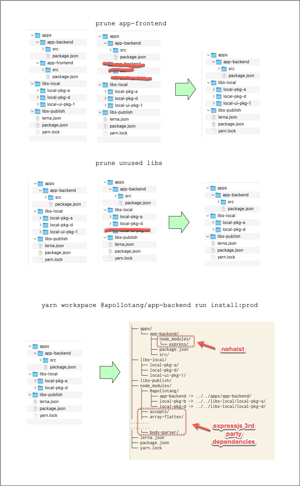

// file: ./package.json

```
{
  "name": "monorepo",
  "version": "1.0.0",
  "private": true,
  "main": "index.js",
  "license": "MIT",
  "workspaces": [
    "apps/*",
    "libs-local/*",
    "libs-publish/*"
  ],
  "devDependencies": {
    "jest": "*"      //<----- this is never install b/c of "--production"
  },
  "scripts": {
    "mono:bootstrap": "npx lerna bootstrap --use-workspaces",
    "mono:clean": "rm -fr node_modules && lerna clean",
    "app-backend:prune-apps": "mv apps/app-backend/ apps/tmp/ && rm -fr apps/app-* && mv apps/tmp/ apps/app-backend",
    "app-backend:prune-libs-local": "## TODO",
    "app-backend:install-prod": "yarn app-backend:prune-apps && yarn workspace @apollotang/app-backend run install:prod"
  }
}
```

file: ./apps/app-backend/package.json

```
{
  "name": "@apollotang/app-backend",
  "version": "1.0.0",
  "private": true,
  "workspaces": {
    "nohoist": [
      "*"
    ]
  },
  "main": "src/index.js",
  "author": "Apollo Tang",
  "license": "MIT",
  "dependencies": {
    "@apollotang/local-pkg-b": "1.0.0",
    "express": "*"
  },
  "scripts": {
    "install:prod": "yarn --production"
  }
}
```