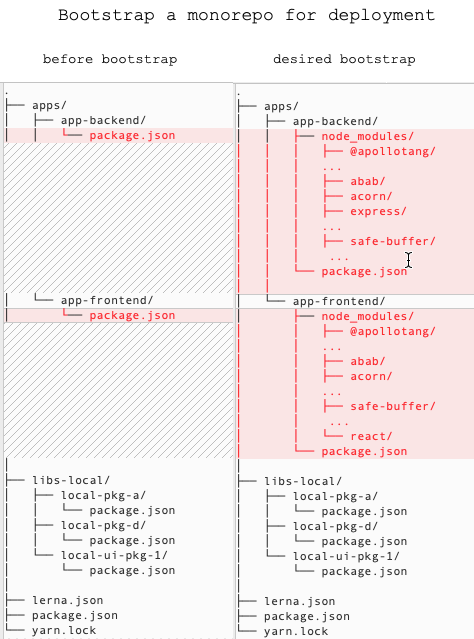
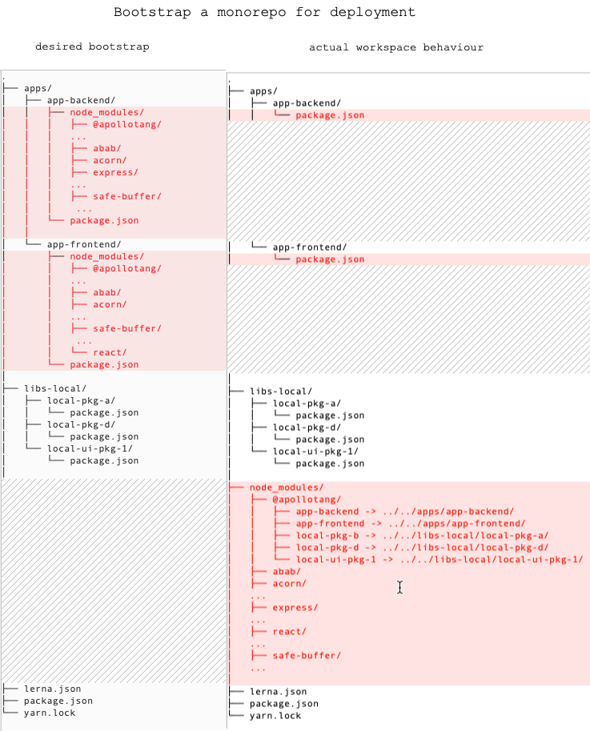
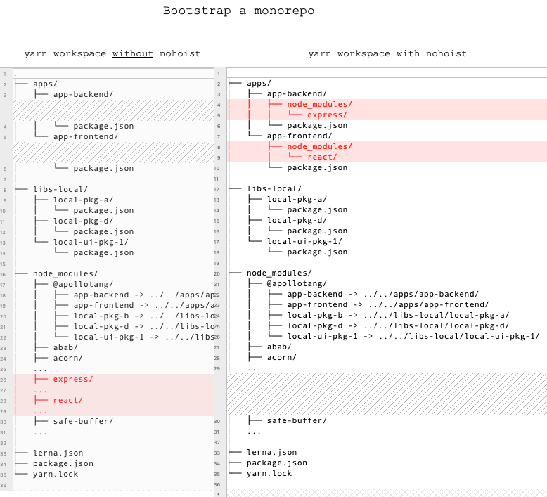
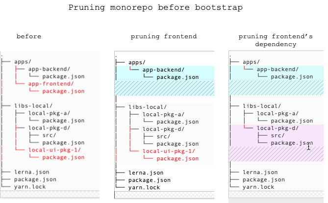
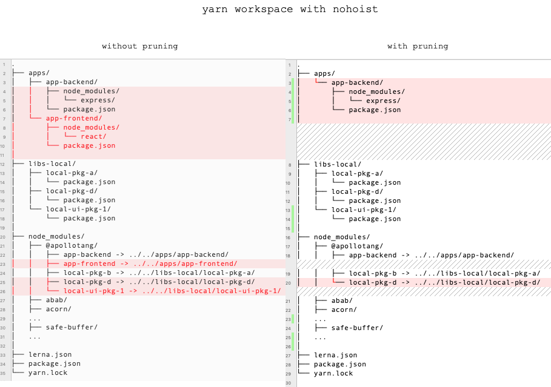

# Preparing monorepo to deploy a project with pruning strategies 
<br>
---
<br>

```
.
├── apps/
│   ├── app-backend/
│   │   └── package.json
│   └── app-frontend/
│       └── package.json
│
├── libs-local/
│   ├── local-pkg-a/            // <-- Used by backend
│   │   └── package.json  
│   ├── local-pkg-d/            // <-- Used by backend
│   │   └── package.json 
│   └── local-ui-pkg-1/         // <-- Used by frontend 
│       └── package.json
│
├── lerna.json
├── package.json
└── yarn.lock
```
<br>
---
<br>



<br>
---
<br>



<br>
---
<br>



<br>
---
<br>

### Pruning monorepo

```
  "scripts": {
    "mono:bootstrap": "npx lerna bootstrap --use-workspaces",
    "mono:clean": "rm -fr node_modules && lerna clean",
    "app-backend:prune-apps": "mv apps/app-backend/ apps/tmp/ && rm -fr apps/app-* && mv apps/tmp/ apps/app-backend",
    "app-backend:prune-libs-local": "## TODO",
    "app-backend:install-prod": "yarn app-backend:prune-apps && yarn workspace @apollotang/app-backend run install:prod"
  }
```



<br>
---
<br>


